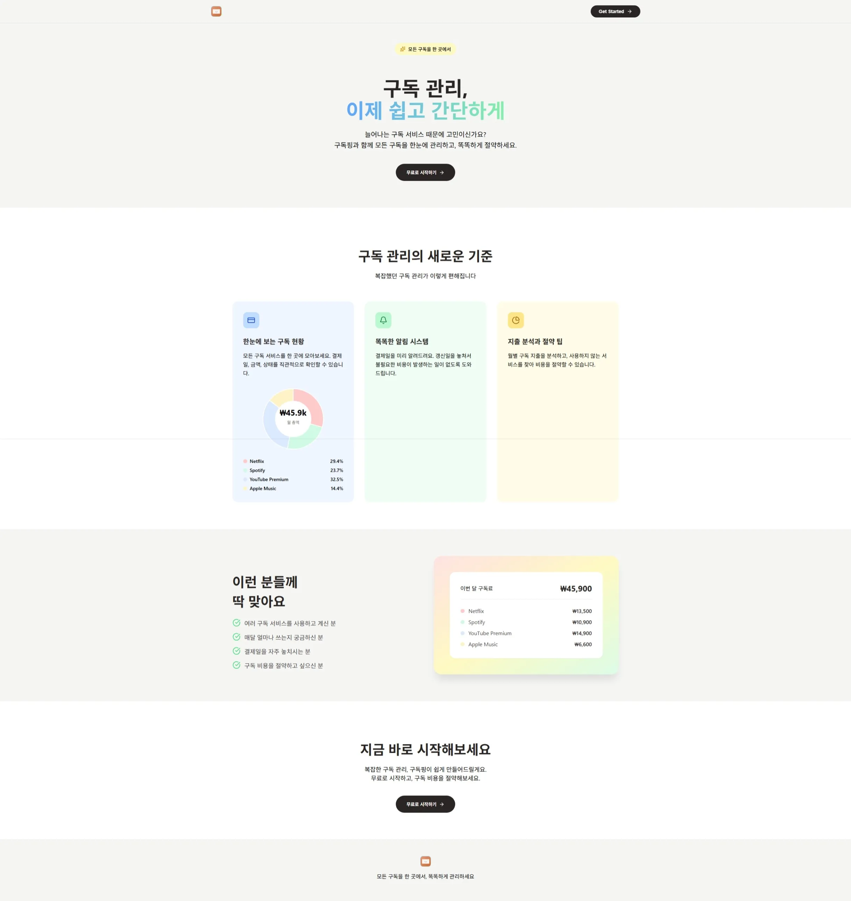
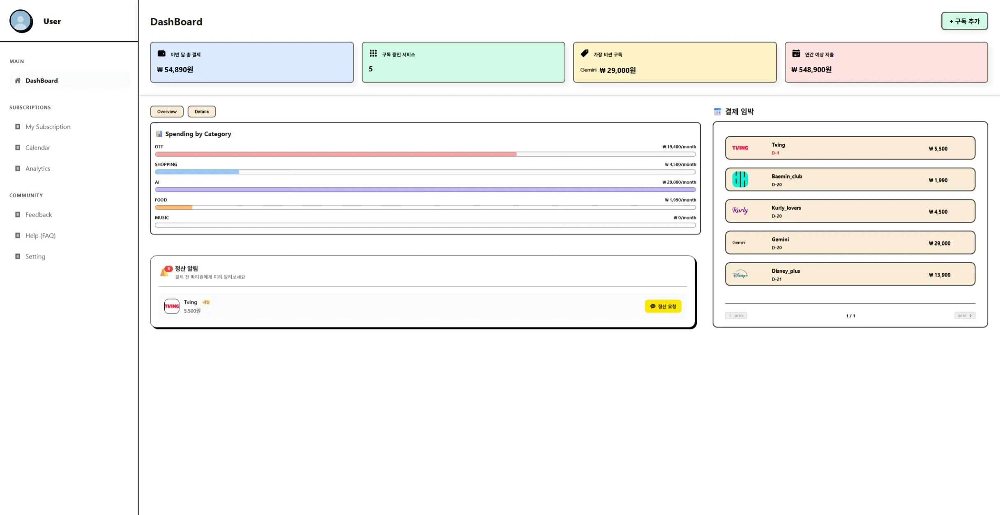
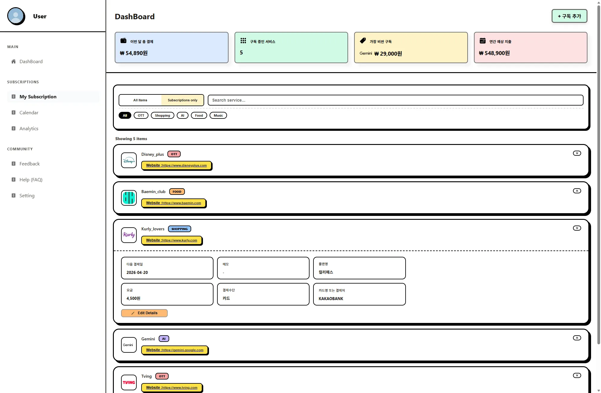
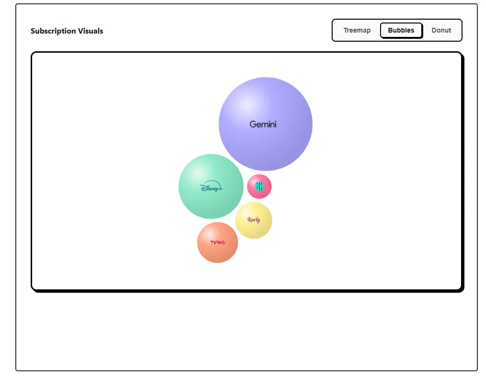
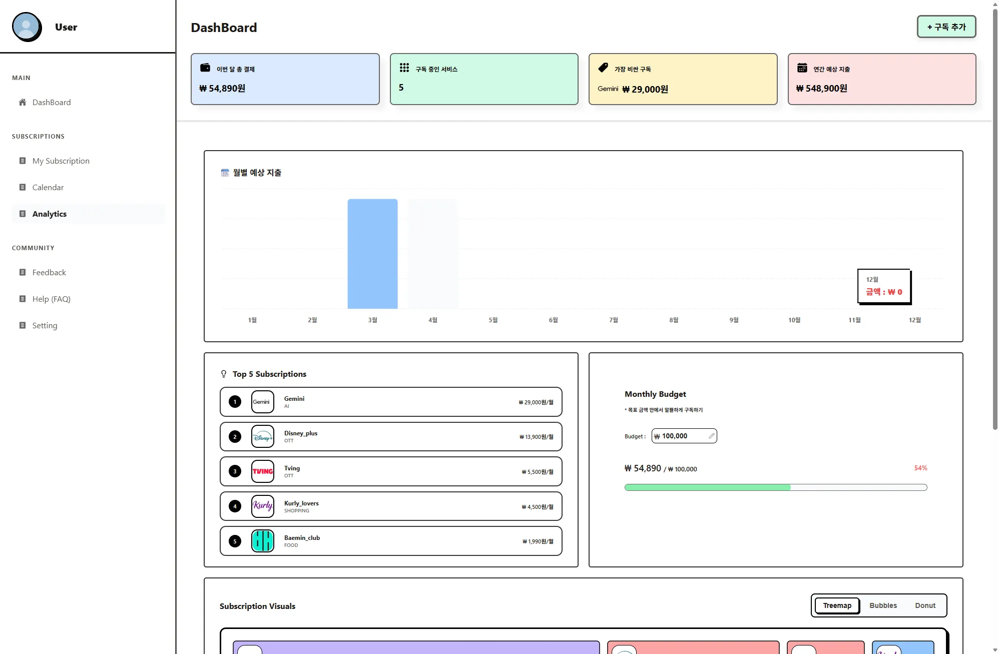
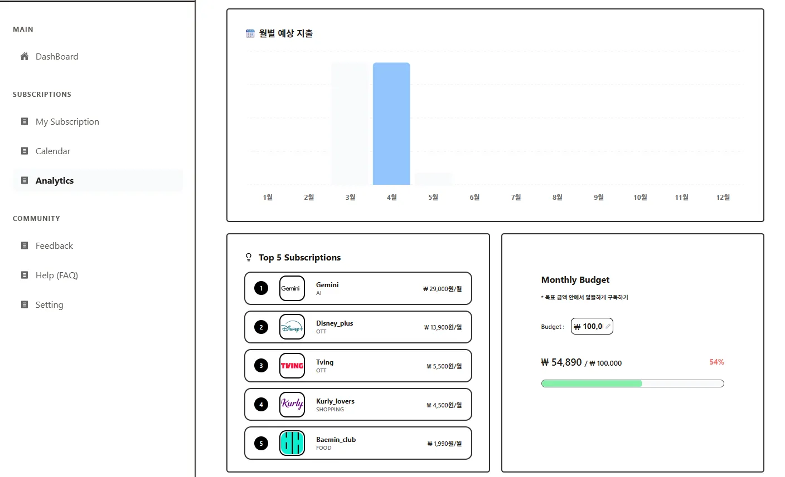
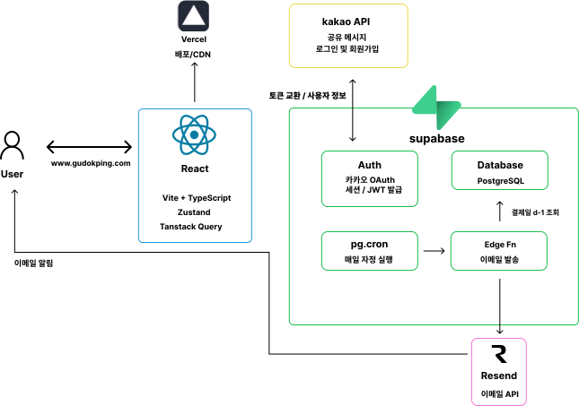

### 구독핑 (GudokPing)

**구독 서비스 통합 관리 및 카카오톡 정산 알림 플랫폼**

 https://www.gudokping.com

  

### 서비스 소개

흩어진 구독 서비스를 한 곳에서 관리하고,  
결제일이 다가오면 카카오톡으로 파티원에게 정산을 요청할 수 있는 서비스입니다.

  

  
  
  
  
  
  

  

### 구독핑은 이런 분들을 위한 서비스입니다.

 - 친구들과 구독을 공유하고 1/N 정산을 받아야 하는데 매번 카톡 보내기 번거로운 분
 - 무료 체험 후 깜빡하고 결제가 되어버린 경험이 있는 분
 - 내가 매달 구독에 얼마를 쓰는지 한눈에 파악하고 싶은 분

  

### 기술 스택

    
   
  
  

  

### 아키텍처

